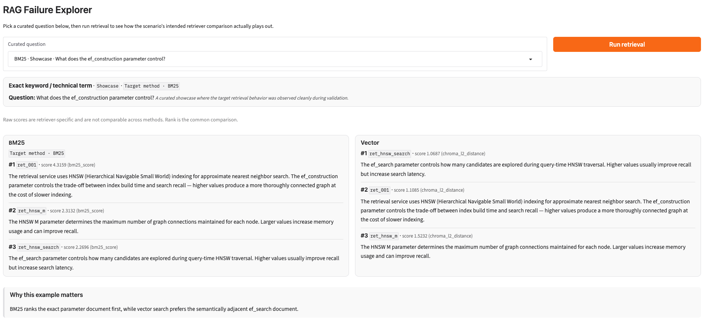
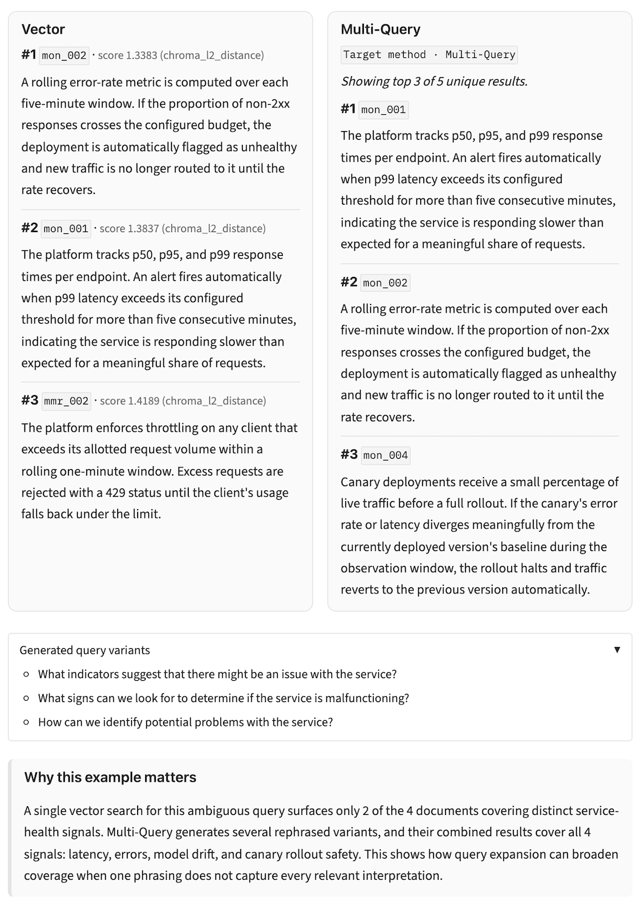
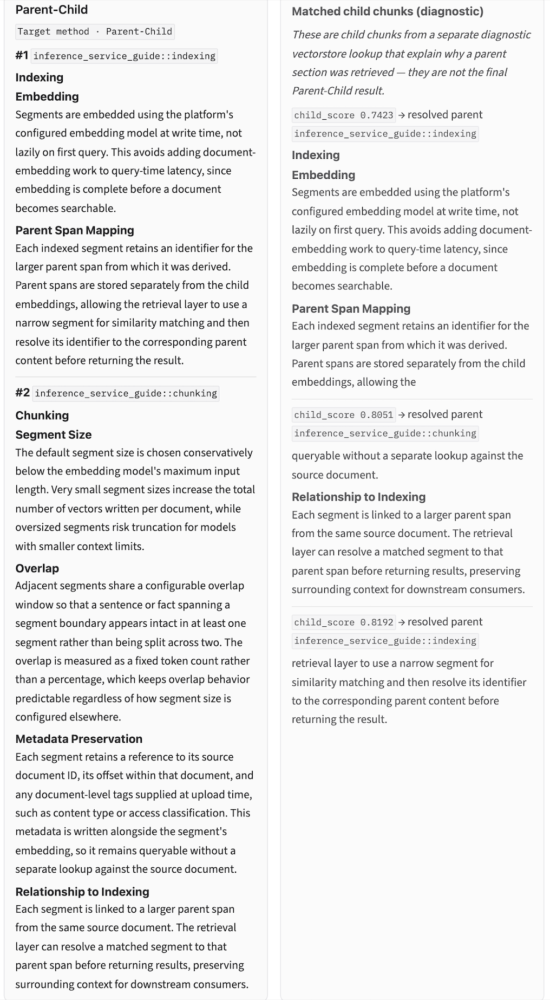
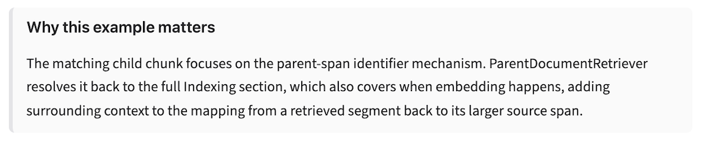

# RAG Failure Explorer

Retrieval is not one-size-fits-all. This project compares five retrieval strategies (BM25, vector search, Multi-Query, MMR, and Parent-Child) on a small hand-designed corpus. Each curated question is a controlled example that shows when a retrieval mechanism helps, when it does not, and why. It does not try to name a single "best" retriever. It retrieves and compares documents only; it does not generate answers.

## Screenshots
**Question: BM25 and Vector side by side for "What does the ef_construction parameter control?"**
<a href="docs/images/bm25-showcase.png">
  
</a>

**Question: Vector's top 3 against the top 3 of the Multi-Query union (5 unique results).**
<a href="docs/images/multi-query-showcase.png">
  
</a>

**Question: How does the index map a retrieved segment back to the larger parent content it came from?**

<a href="docs/images/parent-child.png">
  
</a>
<a href="docs/images/parent-child-why.png">
  
</a>


## What the project does

- **Five retrieval strategies** in `retrievers/`, all returning one result shape: BM25, Vector (semantic search), Multi-Query, MMR, and Parent-Child.
- **A hand-designed corpus**: 27 short documents in `corpus/corpus.json`, plus one long Markdown guide split on `##` headings for the Parent-Child examples. Documents carry a `scenario_group` label for each designed cluster.
- **11 curated questions** in `corpus/questions.json`: 8 showcases and 3 findings, covering all five scenario types.
- **Scenario-specific validation** (`corpus/validate_questions.py`, `just validate`) checks each question against the mechanism it is meant to demonstrate.
- **A Gradio UI** (`ui/app.py`, `just run`) to browse the questions and run the matching comparison.

Terms used throughout:

- **Showcase**: a curated example where the target retrieval behavior was observed cleanly during validation.
- **Finding**: an intentionally retained example where the expected advantage did not appear cleanly. The non-result is informative: it marks a limit or condition of the mechanism. Findings are not failed tests awaiting tuning: the validator excludes them from its needs-iteration list. Examples that still did not produce a clean contrast after rework were kept as findings rather than forced.

Current `just validate` result: 8 PASS (all showcases), 3 AMBIGUOUS (the three findings), 0 FAIL, 0 malformed.

## Architecture

```text
                       ┌─────────────────────┐
                       │   Curated data      │
                       │                     │
                       │ • 27 short docs     │
                       │ • long guide        │
                       │ • 11 questions      │
                       └──────────┬──────────┘
                                  │
                                  ▼
                    ┌───────────────────────────┐
                    │    Retrieval strategies   │
                    │                           │
                    │  BM25       Vector        │
                    │  Multi-Query MMR          │
                    │  Parent-Child             │
                    └─────────────┬─────────────┘
                                  │
                    retrieval results / ranks
                                  │
                    ┌─────────────┴─────────────┐
                    ▼                           ▼
          ┌───────────────────┐       ┌───────────────────┐
          │ Scenario validator│       │     Gradio UI     │
          │   just validate   │       │     just run      │
          └───────────────────┘       └───────────────────┘
```

Implementation details:

- `corpus/loader.py` loads short documents without embedding metadata into the text and splits the long Markdown guide into stable parent sections for Parent-Child retrieval.
- Vector, MMR, and Multi-Query reuse one in-memory Chroma store with `text-embedding-3-small`; BM25 uses a separate lexical index.
- Parent-Child matches smaller child chunks and returns their larger parent section; child hits are shown only as diagnostics.
- `corpus/validate_questions.py` runs the scenario-specific validation logic, while `ui/app.py` exposes the same curated experiments through Gradio.
## Key findings

These are observations from one small hand-designed corpus and 11 questions. They are not general laws. A weak showcase candidate can reflect question design rather than a retriever failure.

### BM25 and exact technical terms

- In the one clean BM25 showcase, the exact lexical distinction separated two semantically similar HNSW parameter documents. BM25 ranks the `ef_construction` document (ret_001) first. Vector ranks the semantically adjacent `ef_search` document (ret_hnsw_search) first.
- Vector also ranks `ef_search` first for the mirror `ef_search` question. The behavior is asymmetric: Vector prefers the same near-twin document for both HNSW parameter questions. That mirror question is kept as a finding because both BM25 and Vector rank its target first.
- The IVF-PQ question is also a finding: both retrievers rank its target first.
- The other exact-term examples show that a rare technical term alone did not guarantee a BM25 advantage on this corpus. Semantically confusable neighboring documents, not term rarity alone, decided the outcome in the clean case. Do not generalize beyond these examples.

### Vector and paraphrase

The two Vector showcases behave differently and are described separately.

- **Login-token showcase.** Vector ranks `sec_001` first. BM25 places a different document first (`sec_002`), but the target is still retrieved at rank 2.
- **Service-account showcase.** Vector ranks `sec_002` first. `sec_002` is absent from BM25's top 10, the validator's inspection window. This is the cleaner case of semantic retrieval succeeding despite weak lexical correspondence: the question describes an automated system operating with no person logged in, while the source document uses "service accounts" and "machine-to-machine."

### Multi-Query

- **Under-specified service-health query (showcase).** Vector's top 3 cover 2 of the 4 designed service-health documents. The full Multi-Query union (5 unique results) covers all 4.
- **Deployment-health query (finding).** Vector already covers 3 of the 4 service-health documents, and the Multi-Query union covers the same 3. Multi-Query adds no scenario-group coverage here.
- Multi-Query can help when the original query misses facets, and adds little when it already covers them. The original query is included among the variants. The union is not truncated to k; the UI displays only the top 3.

### MMR

- Vector's top 3 can fill with near-duplicate documents from the `rate_limit_restated` cluster. In both rate-limit showcases, Vector's top 3 contain 3 cluster members.
- MMR reduces that redundancy while keeping at least one cluster member: its top 3 contain 2 cluster members.
- The document MMR introduces comes from another topic in both showcases: `lim_002` (upload size limit) in one, `mon_001` (latency alerts) in the other. The validator checks redundancy reduction but does not judge the relevance of introduced documents, so treat them as diverse neighbors of uncertain relevance.

**Diversity can reduce redundancy. Diversity alone does not guarantee equal relevance.**

### Parent-Child

- Matching happens against small child chunks. `ParentDocumentRetriever` returns the larger parent section they belong to.
- The Chunking showcase resolves to `inference_service_guide::chunking` at rank 1. The Indexing showcase resolves to `inference_service_guide::indexing` at rank 1.
- The diagnostic child hits explain which chunks matched. They are debugging information, not the canonical returned result.
- Child chunks come from a character-based splitter and can start or end mid-sentence, so the diagnostic panel can show fragments (visible in the screenshot).
- These examples demonstrate context recovery, not universal superiority.

## Methodology and design decisions

**A. Validator design: no universal metric.** There is no single validation metric across all retrievers. Each scenario is validated by the retrieval behavior it is meant to demonstrate, and the checks are scenario-specific by design.

**B. Rank is the common observable, and raw scores are not compared.** BM25 scores and Chroma L2 distances have different meanings and scales, so the raw numbers are never compared across methods or normalized to a shared range. MMR, Multi-Query, and Parent-Child return `score=None`. Rank is the shared comparison surface in this controlled setup. It is the common observable used here, not a perfect universal metric.

**C. Validator rules.**

- *BM25 vs Vector:* inspects whether the target retriever, the comparison retriever, both, or neither place an expected document at rank 1. 
- *Multi-Query vs Vector:* compares intended scenario-group coverage in plain Vector's top 3 with the full, untruncated Multi-Query union.
- *MMR vs Vector:* checks that Vector's top 3 contain at least two cluster members, and that MMR's top 3 contain fewer while keeping at least one.
- *Parent-Child:* checks that the expected parent appears in the top 3, and that the top parent agrees with the top resolved parent from the diagnostic child search.

The code in `corpus/validate_questions.py` is the source of truth for exact verdict branches.

**D. BM25 tokenization.** `experiments/bm25_preprocessing.py` compared three configurations on a small early validation sample: the default whitespace split, normalized tokenization (lowercase, surrounding punctuation stripped, hyphens and underscores kept), and normalized tokenization plus a hand-chosen stopword list. Normalization alone worsened at least one paraphrase case: the expected document dropped from rank 2 to rank 4. Adding the stopword list recovered it to rank 1 on that sample. The stopword list is hand-chosen, not canonical, and the comparison covered a small, corpus-specific sample. The normalized-plus-stopwords tokenizer is `retrievers/bm25.py`'s default because it was the most consistent of the three on that sample. It is not presented as an optimal BM25 pipeline.

**E. Parent-Child structure.** `corpus/loader.py` splits the guide on `##` headings with `MarkdownHeaderTextSplitter` and gives each section a stable ID. `ParentDocumentRetriever` receives only a child splitter (`RecursiveCharacterTextSplitter`, `chunk_size=500`, `chunk_overlap=75`) and `parent_splitter=None`. Parents keep explicit IDs rather than generated UUIDs.

**F. Explanations.** The explanations are hand-written from the observed validation results. No LLM call is used to generate explanations at runtime.

**G. Runtime model use.** `gpt-4o-mini` (temperature 0) generates Multi-Query variants only. `text-embedding-3-small` embeds the corpus for Vector, MMR, Multi-Query, and Parent-Child. There is no answer synthesis.

**H. UI execution model.** Selecting a question only shows its metadata. Retrieval runs only when "Run retrieval" is clicked. The "Target method" label is static curation metadata, not a winner inferred from the current run. Findings are not presented as winners. Parent-Child child diagnostics are shown separately from the final results.

**I. Tooling.** Python 3.12, uv, pyproject.toml, just, pytest, and ruff. Dependencies are pinned with `==`.
## Limitations

- The corpus is small and hand-designed: 27 short documents plus one long guide. The examples demonstrate mechanisms by construction. This is not a retrieval benchmark, and no benchmark numbers are claimed.
- `scenario_group` is a designed evaluation label, not a human relevance judgment. Coverage and redundancy are measured against these predefined groups. For example, a throttling document may be related to the query, but it does not count toward the four service_health_signals facets unless it belongs to that group.
- Multi-Query variants are LLM-generated and can differ between runs, so its retrieved union may also vary.
- The Parent-Child examples check that the expected parent is returned and that it agrees with the diagnostic child match. They are not compared against a baseline that returns the child chunk alone, so no measured advantage is claimed. The long guide has three parent sections of two to four short subsections each, so the added context is modest.
- When fewer than three documents share tokens with a query, BM25 returns zero-score documents, ordered by corpus position rather than relevance.
- There is one embedding model and a fixed configuration per method. The repository contains no systematic hyperparameter sweep. MMR is fixed at fetch_k=10 and lambda_mult=0.5.
- BM25 raw-score extraction relies on `BM25Retriever` internals (`vectorizer`, `preprocess_func`). It is isolated in one helper, `_raw_bm25_scores`.
- Generated Multi-Query variants are captured through LangChain logging because the retriever does not expose them through its public result API.
- The UI has no free-text input and no answer generation.

## Setup and usage

Prerequisites: Python 3.12, [uv](https://docs.astral.sh/uv/), [just](https://just.systems/), and an OpenAI API key.

```bash
git clone https://github.com/akmaral-yes/rag-failure-explorer.git
cd rag-failure-explorer
cp .env.example .env        # then set OPENAI_API_KEY in .env
just install                # uv sync --all-extras
just run                    # Gradio UI at http://127.0.0.1:7860
just validate               # scenario checks for all curated questions
just test                   # pytest, including 2 integration tests that call OpenAI
just smoke                  # retriever smoke test: prints each retriever's output
```

Also available: `just lint`, `just format`, `just check` (lint and tests), and `just clean`. Two tests are marked `integration` and call OpenAI, so `just test` requires a valid OPENAI_API_KEY.

## Project structure

```
corpus/
  corpus.json                   27 short documents
  questions.json                11 curated questions
  loader.py                     corpus loading, long-guide parent split
  validate_questions.py         scenario-specific validator (just validate)
  long_docs/
    inference_service_guide.md  long guide for Parent-Child
retrievers/
  common.py                     shared result shape
  bm25.py                       BM25 retriever
  bm25_preprocessing.py         BM25 tokenizers
  vector.py                     Vector retriever, shared Chroma store
  multi_query.py                Multi-Query retriever
  mmr.py                        MMR retriever
  parent_child.py               Parent-Child retriever
  smoke_test.py                 smoke test (just smoke)
experiments/
  bm25_preprocessing.py         three-way BM25 tokenization comparison
ui/
  app.py                        Gradio app (just run)
tests/                          corpus invariants, retriever sanity checks
docs/images/                    README screenshots
config.py                       model names, retrieval defaults
justfile                        task runner
pyproject.toml                  pinned dependencies, tool config
LICENSE                         MIT
```

## License

MIT. See [LICENSE](LICENSE).
